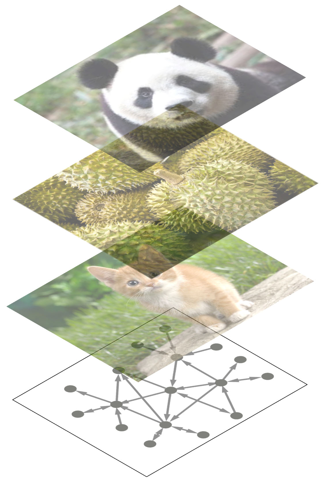

# Graph ConvNets in PyTorch
October 15, 2017
<br>
<br>





### Xavier Bresson
 http://www.ntu.edu.sg/home/xbresson<br>
 https://github.com/xbresson<br>
 https://twitter.com/xbresson <br>
<br>


### Description
Prototype implementation in PyTorch of the NIPS'16 paper:<br>
Convolutional Neural Networks on Graphs with Fast Localized Spectral Filtering<br>
M Defferrard, X Bresson, P Vandergheynst<br>
Advances in Neural Information Processing Systems, 3844-3852, 2016<br>
ArXiv preprint: [arXiv:1606.09375](https://arxiv.org/pdf/1606.09375.pdf) <br>
<br>

### Code objective
The code provides a simple example of graph ConvNets for the MNIST classification task.<br>
The graph is a 8-nearest neighbor graph of a 2D grid.<br>
The signals on graph are the MNIST images vectorized as $28^2 \times 1$ vectors.<br>
<br>


### Installation
   ```sh
   git clone https://github.com/xbresson/graph_convnets_pytorch.git
   cd graph_convnets_pytorch
   pip install -r requirements.txt # installation for python 3.6.2
   python check_install.py
   jupyter notebook # run the 2 notebooks
   ```

<br>


### Results
GPU Quadro M4000<br>
* Standard ConvNets: **01_standard_convnet_lenet5_mnist_pytorch.ipynb**, accuracy= 99.31, speed= 6.9 sec/epoch. <br>
* Graph ConvNets: **02_graph_convnet_lenet5_mnist_pytorch.ipynb**, accuracy= 99.19, speed= 100.8 sec/epoch <br>
<br>


### Note
PyTorch has not yet implemented function torch.mm(sparse, dense) for variables: https://github.com/pytorch/pytorch/issues/2389. It will be certainly implemented but in the meantime, I defined a new autograd function for sparse variables, called "my_sparse_mm", by subclassing torch.autograd.function and implementing the forward and backward passes.


```python
class my_sparse_mm(torch.autograd.Function):
    """
    Implementation of a new autograd function for sparse variables, 
    called "my_sparse_mm", by subclassing torch.autograd.Function 
    and implementing the forward and backward passes.
    """
    
    def forward(self, W, x):  # W is SPARSE
        self.save_for_backward(W, x)
        y = torch.mm(W, x)
        return y
    
    def backward(self, grad_output):
        W, x = self.saved_tensors 
        grad_input = grad_output.clone()
        grad_input_dL_dW = torch.mm(grad_input, x.t()) 
        grad_input_dL_dx = torch.mm(W.t(), grad_input )
        return grad_input_dL_dW, grad_input_dL_dx
```
<br>


### When to use this algorithm?
Any problem that can be cast as analyzing a set of signals on a fixed graph, and you want to use ConvNets for this analysis.<br>

<br>

<br>
<br>

